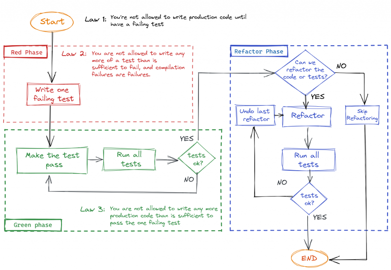

## Implement Portfolio

```text
As a Bank Consumer
I want to convert a given amount in currency into another currency
So it can be used to evaluate client portfolios
```

From now on, we would like to handle operations between amounts in different currencies:
- [ ] 5 USD + 10 EUR = 17 USD
- [ ] 1 USD + 1100 KRW = 2200 KRW

We need to bring a new business concept to our implementation: a `Portfolio`.

Basically, a `Portfolio` contains a **list of amounts in various currencies**. 

Taking our first example above, it could contain `5 USD` and `10 EUR`.

We should be able to **evaluate** the full `Portfolio` amount in a **given currency**:
- `USD` => `17 USD`
- `EUR` => `14,1 EUR`
- `KRW` => `18940 KRW`
- etc.

Your mission in this iteration is to implement the `Portfolio`.

### Example mapping


- Start by writing the User Story being discussed on a `yellow post-it` note and placing it at the top of the table.
- Then we write each of the acceptance criteria, or rules we already know, on a blue post-it and place them under the yellow post-it of the User Story.
- For each rule, we may need one or more examples to illustrate it.
  - Write them on a green post-it note and place them under the relevant rule.
  - You may write them using a `Given - When - Then` template:
```gherkin
Scenario Evaluate a Portfolio in EUR
    Given a Portfolio with ...
      And a Bank with ...
    When I evaluate the Portfolio in EUR into the Bank 
    Then the amount is ...
```
- When discussing these examples, you may discover questions that no one in the room can answer. 
  - These are written on a red post-it and the conversation continues.


### Implement Portfolio using TDD




Small reminder regarding it: the `Red` step is either a test failure or a compilation error.

Please take some time to read how to [generate Code From Usage](https://xtrem-tdd.netlify.app/Flavours/generate-code-from-usage).

There are different strategies when you want to go from a `red` state to a `green` state:
- `Fake it until you make it`
- `Obvious implementation`
- `Triangulation`

We recommend to use `Fake it until you make it` for the first test.
