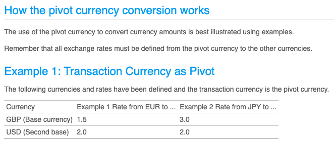

## Pivot currency

### The Problem
- We have worked closely with our domain experts and at one point we spotted a problem together with the exchange rates

| From | To   | Rate    |
|------|------|---------|
| EUR  | USD  | 1.2     |
| USD  | EUR  | 0.82    |
| USD  | KRW  | 1100    |
| KRW  | EUR  | 0.0009  |
| EUR  | KRW  | 1344    |
| KRW  | EUR  | 0.00073 |

- We have 2 times a line for `KRW` to `EUR`
- We discussed with our experts, and they explain to us that they have `simply` written the wrong destination currency (To) on line 4 (Apparently, it can often happens...)

After a fix, the table now looks like this:

| From | To  | Rate    |
|------|-----|---------|
| EUR  | USD | 1.2     |
| USD  | EUR | 0.82    |
| USD  | KRW | 1100    |
| KRW  | USD | 0.0009  |
| EUR  | KRW | 1344    |
| KRW  | EUR | 0.00073 |

- We are not fully confident in this table that will be at the center of our system
  - We discuss again with our experts on a way to enforce this table coherence/consistency
  - The conclusion is that we can easily improve it by checking what they call `Round-Tripping`
  - `from(to(x)) == x`

We asked our business experts to be more explicit on the features provided by a Bank.

They worked on it and detailed some `User Stories` and defined some concepts to add to our `Ubiquitous Language`.

**Pivot Currency**: The pivot currency is the currency via which the other currency values are calculated.

- **Story 1: Define Pivot Currency**
```text
As a Foreign Exchange Expert
I want to be able to define a Pivot Currency
So that I can express exchange rates based on it
```
- **Story 2: Add an exchange rate**
```text
As a Foreign Exchange Expert
I want to add/update exchange rates by specifying: a multiplier rate and a currency
So they can be used to evaluate client portfolios
```
- **Story 3: Convert a Money**
```text
As a Bank Consumer
I want to convert a given amount in currency into another currency
So it can be used to evaluate client portfolios
```



### Let's do it
- Run an `Example Mapping` workshop using the `User Stories` defined above as an input.
- Start by an individual time in which everyone can write his/her questions
  - Try to answer those questions based on your current understanding
- Extract business rules from your discussions
- For each business rule, identify at least 1 `key example`

## Redesign the Bank

- Use your examples to implement:
  - a mandatory Pivot Currency for Bank
  - an ExchangeRate value object
- Try to keep the test suite as green as possible
 
