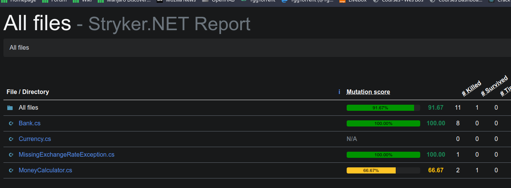

# Mutation Testing

## Instructions

- Use npm to install stryker
`npm i -g stryker-cli`

- Run stryker command
`stryker run`

- Check the report inside StrykerOutput folder

- Check remaining mutants

## MissingExchangeRateException

Stryker was able to create a mutant as we don't verify the exception message. The processed replaced the exception message by an empty string and our test still passed.

It proves our test isn't reliable.
Testing the message does provide value as it contain business information.

When implemented, verify your test pass and run the stryker command again.

## MoneyCalculator

Stryker was able to create a mutant as we don't have any assertion in our test.

 When implemented, verify your test pass and run the stryker command again.

## Mutants eradicated!

 Congratulations you have killed your first mutants !!!

Why you should focus on good assertion?
- Take a look at the [Test Desiderata](https://kentbeck.github.io/TestDesiderata/)
